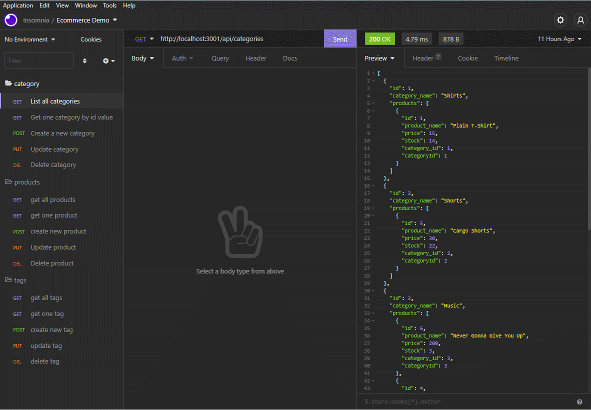
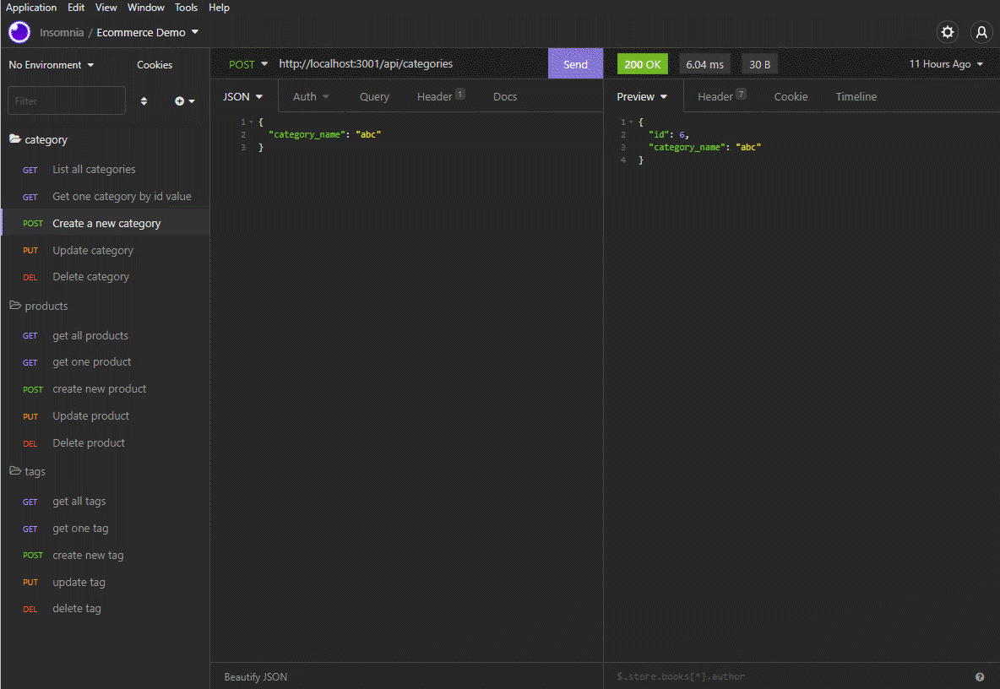
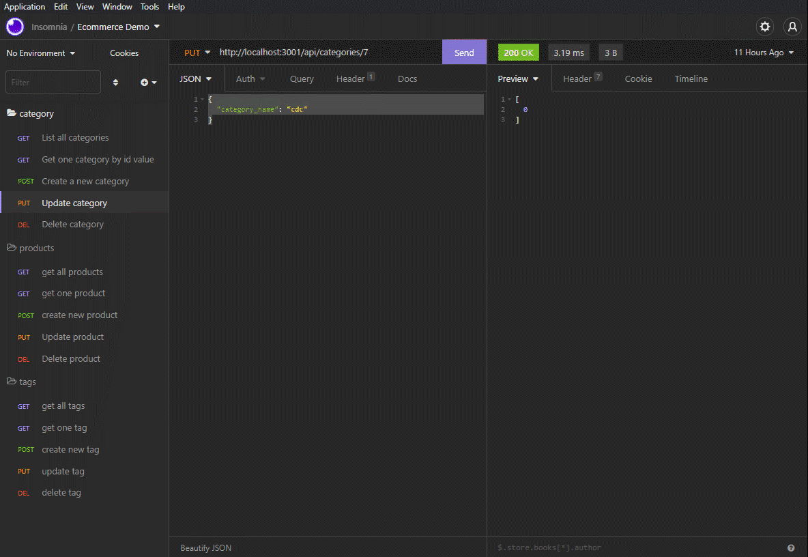
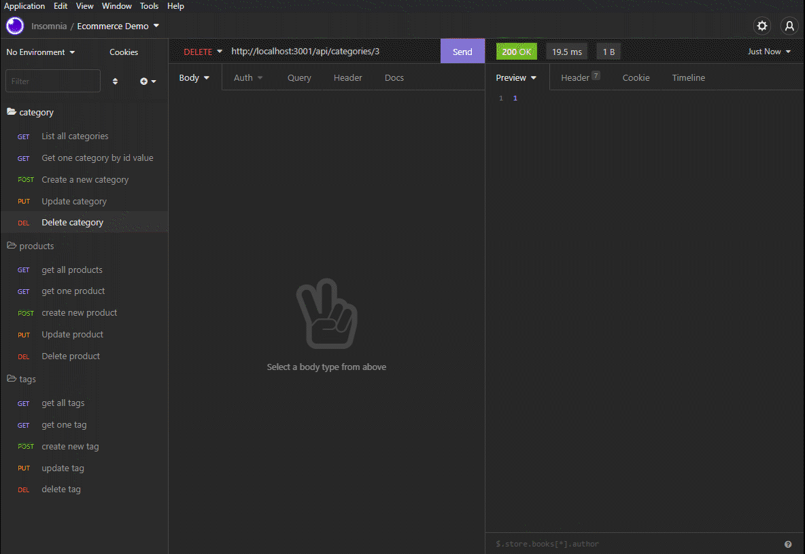

# E-Commerce-Back-End


## Description

    The back end set-up for an e-commerce site.

## Built With

```
- JavaScript
- MySql
- mysql2
- sequelize
- express
- dotenv
- Insomnia
```

| Table of Contents                 |
| --------------------------------- |
| [I Installation.](#installation)  |
| [II Usage.](#usage)               |
| [III License.](#licenses)         |
| [IV Contributing.](#contributing) |
| [V Tests.](#tests)                |
| [VI Questions.](#questions)       |

## Installation

    Clone the repo git clone https://github.com/Wratten/E-Commerce-Back-End.git Install dependencies npm install

## Usage

To run this app,

    npm run seed

    node server.js

The API endpoints can be tested using Insomnia, Postman or another route testing application.

### Get Request Demo



### Post Request Demo



### Put Request Demo



### Delete Request Demo



## Contributions

    Contributions are what make the open source community such an amazing place to learn, inspire, and create. Any contributions you make are greatly appreciated.

    If you have a suggestion that would make this better, please fork the repo and create a pull request. Thanks again!

## Tests

     No tests have been developed for this app.

## License

      This project is using the MIT license.

## Questions

If you have any questions about this repo please feel free to reach out to me through [GitHub](https://github.com/Wratten) or [Email](mailto:daniel.wratten@gmail.com)
